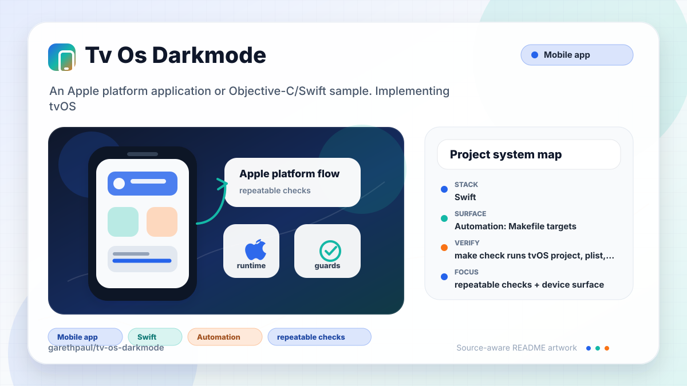

# tv-os-darkmode

<!-- README-OVERVIEW-IMAGE -->


## Overview

`garethpaul/tv-os-darkmode` is an Apple platform application or Objective-C/Swift sample. Implementing tvOS changes for dark/light mode

This README is based on the checked-in source, manifests, scripts, and repository metadata on the `master` branch. The project language mix found during review was: Swift (2).

## Repository Contents

- `SECURITY.md` - security reporting and disclosure guidance
- `CHANGES.md` - maintenance history for tvOS appearance checks
- `Makefile` - local verification entry points
- `docs/plans` - completed maintenance plans for the current baseline
- `plans` - historical implementation notes
- `scripts` - static tvOS contract validators
- `tvos-darkmode` - source or example code
- `tvos-darkmode.xcodeproj` - Xcode project file
- `VISION.md` - project direction and maintenance guardrails

Additional scan context:

- Source directories: tvos-darkmode
- Dependency and build manifests: none detected
- Entry points or build surfaces: tvos-darkmode.xcodeproj
- Test-looking files: no obvious test files detected

## Getting Started

### Prerequisites

- Git
- macOS with Xcode for building Apple platform projects

### Setup

```bash
git clone https://github.com/garethpaul/tv-os-darkmode.git
cd tv-os-darkmode
```

The setup commands above are derived from repository files. Legacy mobile, Python, or JavaScript samples may require older SDKs or package versions than a modern workstation uses by default.

## Running or Using the Project

- Open `tvos-darkmode.xcodeproj` in Xcode, choose the app or sample scheme, and run it on the matching simulator/device.
- Run `make check` for static repository checks. The `build` step runs `xcodebuild` only on hosts where it is installed.

## Testing and Verification

- `make check` runs tvOS project, plist, asset, appearance-state, and
  appearance-label accessibility, scaling, and contrast contract checks.
- Static checks also require completed canonical plans under `docs/plans`.
- Xcode's test action or `xcodebuild test` with the appropriate scheme and destination on macOS

### Manual Appearance Verification

- Run the app on a tvOS simulator or device in Light appearance and confirm the
  centered label reads `Light Mode` with a white background.
- Switch the simulator or device to Dark appearance, then confirm the centered
  label reads `Dark Mode` with a black background.
- If the runtime does not expose `userInterfaceStyle`, confirm the fallback
  label reads `Appearance Unavailable`.

When the required SDK or runtime is unavailable, use static checks and source review first, then verify on a machine that has the matching platform toolchain.

## Configuration and Secrets

- No required secret or credential file was identified in the repository scan. If you add integrations later, keep secrets out of git.

## Security and Privacy Notes

- Review changes touching network requests, sockets, or service endpoints; examples from the scan include tvos-darkmode/Info.plist.
- Review changes touching file, media, JSON, XML, CSV, OCR, or data parsing; examples from the scan include tvos-darkmode/Assets.xcassets/App Icon & Top Shelf Image.brandassets/Contents.json, tvos-darkmode/Info.plist.

## Maintenance Notes

- This looks like an Apple platform project or sample. Xcode, Swift, CocoaPods, and deployment target versions may need to match the original project era.
- See `SECURITY.md` for vulnerability reporting and safe research guidance.
- See `VISION.md` for project direction and contribution guardrails.
- See `docs/plans/2026-06-08-tvos-darkmode-baseline.md` for the canonical
  appearance-state baseline.
- See `docs/plans/2026-06-08-manual-appearance-verification.md` for the manual
  light/dark verification checklist.
- See `docs/plans/2026-06-08-appearance-contrast-contract.md` for the
  foreground/background appearance contrast guard.
- See `docs/plans/2026-06-09-appearance-label-scaling.md` for the appearance
  label scaling guard.

## Contributing

Keep changes small and tied to the project that is already present in this repository. For code changes, document the toolchain used, avoid committing generated dependency directories or local configuration, and update this README when setup or verification steps change.
