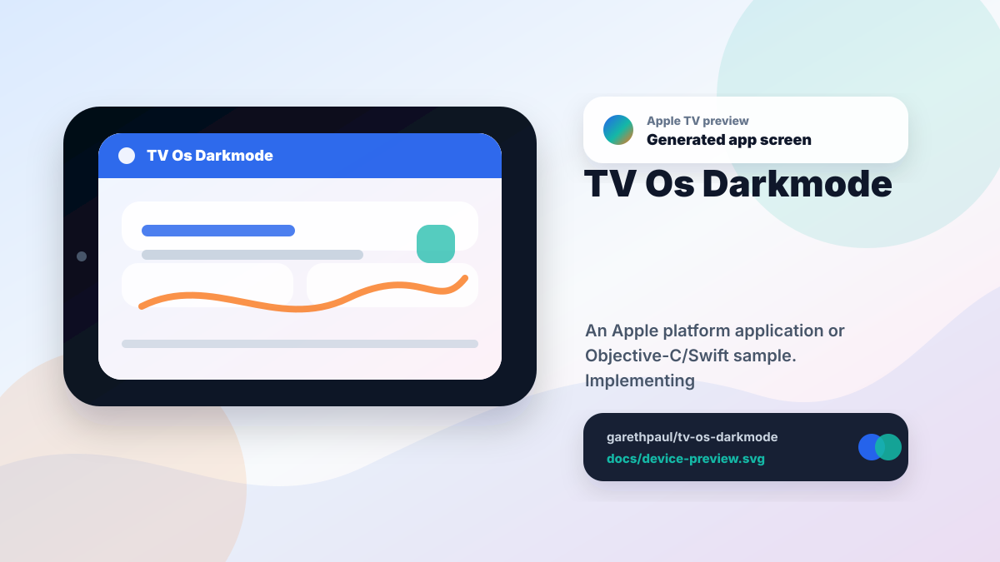

# tv-os-darkmode

<!-- README-OVERVIEW-IMAGE -->


## Device Preview

<!-- DEVICE-PREVIEW-IMAGE -->


## Overview

`tv-os-darkmode` is a focused Swift tvOS sample that displays the current light,
dark, or automatic interface style. The label updates when the trait collection
changes and exposes stable accessibility metadata for inspection and UI tests.

This README is based on the checked-in source, manifests, scripts, and repository metadata on the `master` branch. The project language mix found during review was: Swift (2).

## Repository Contents

- `SECURITY.md` - security reporting and disclosure guidance
- `CHANGES.md` - maintenance history for tvOS appearance checks
- `Makefile` - local verification entry points
- `docs/plans` - completed maintenance plans for the current baseline
- `plans` - historical implementation notes
- `scripts` - static tvOS contract validators
- `tvos-darkmode` - source or example code
- `tvos-darkmode.xcodeproj` - Xcode project file
- `VISION.md` - project direction and maintenance guardrails

Additional scan context:

- Source directories: tvos-darkmode
- Dependency and build manifests: none detected
- Entry points or build surfaces: tvos-darkmode.xcodeproj
- Test source: `tvos-darkmodeTests/AppearancePresentationTests.swift`

## Getting Started

### Prerequisites

- Git
- macOS with Xcode 16.4 for building the tvOS app
- A tvOS 12 or newer simulator or Apple TV for runtime verification

### Setup

```bash
git clone https://github.com/garethpaul/tv-os-darkmode.git
cd tv-os-darkmode
```

The project uses Swift 5 and has no third-party package dependencies.

## Running or Using the Project

- Open `tvos-darkmode.xcodeproj` in Xcode, choose the app or sample scheme, and run it on the matching simulator/device.
- Run `make check` for static repository checks, executable XCTest when Xcode
  is available, and unsigned simulator compilation.
- GitHub Actions runs the portable contract gate on Ubuntu 24.04 and executes
  XCTest with Xcode 16.4 on macOS 15. Both jobs have read-only repository
  permissions, disabled checkout credential persistence, bounded timeouts, and
  immutable action revisions.
- CodeQL analyzes actions and Python without a build, and analyzes Swift from
  an explicit unsigned single-architecture `tvos-darkmode` app-target build
  instead of relying on Xcode target autodetection or the test-bearing scheme.
  The instrumented Swift job has a bounded 25-minute window so analysis can
  finish after the hosted target build.

## Testing and Verification

- `make check` runs tvOS project, plist, asset, appearance-state, and
  appearance-label accessibility, static-text trait, scaling, bounded-layout,
  accessibility-hint, display-only, root-view identifier, and contrast
  contract checks. It also enforces Swift 5, the tvOS 12 deployment floor,
  modern UIKit launch APIs, and hosted Xcode compilation.
- Static checks also require completed canonical plans under `docs/plans`.
- `make test` executes resolver, announcement, initial controller hierarchy,
  and bidirectional trait-transition rendering tests on the Apple TV 4K (3rd
  generation) tvOS 18.5 simulator when Xcode is available and reports an
  explicit skip on non-macOS hosts.
- `make build` compiles the Debug app for the tvOS simulator when Xcode is
  available and reports an explicit skip on non-macOS hosts.

### Manual Appearance Verification

- Run the app on a tvOS simulator or device in Light appearance and confirm the
  centered label reads `Light Mode` with a white background.
- Switch the simulator or device to Dark appearance, then confirm the centered
  label reads `Dark Mode` with a black background. With VoiceOver enabled,
  confirm the updated appearance state is announced after the switch.
- Confirm initial presentation and repeated callbacks for the same appearance
  do not repeat the VoiceOver announcement.
- If the trait collection reports an unspecified style, confirm the fallback
  label reads `Automatic Mode` on a dark gray background.

When the required SDK or runtime is unavailable, use static checks and source review first, then verify on a machine that has the matching platform toolchain.

## Configuration and Secrets

- No required secret or credential file was identified in the repository scan. If you add integrations later, keep secrets out of git.

## Security and Privacy Notes

- Review changes touching network requests, sockets, or service endpoints; examples from the scan include tvos-darkmode/Info.plist.
- Review changes touching file, media, JSON, XML, CSV, OCR, or data parsing; examples from the scan include tvos-darkmode/Assets.xcassets/App Icon & Top Shelf Image.brandassets/Contents.json, tvos-darkmode/Info.plist.

## Maintenance Notes

- Keep the Xcode 16.4, Swift 5, and tvOS 12 baseline aligned across source,
  project settings, static contracts, and hosted verification.
- See `SECURITY.md` for vulnerability reporting and safe research guidance.
- See `VISION.md` for project direction and contribution guardrails.
- See `docs/plans/2026-06-08-tvos-darkmode-baseline.md` for the canonical
  appearance-state baseline.
- See `docs/plans/2026-06-08-manual-appearance-verification.md` for the manual
  light/dark verification checklist.
- See `docs/plans/2026-06-08-appearance-contrast-contract.md` for the
  foreground/background appearance contrast guard.
- See `docs/plans/2026-06-09-appearance-label-scaling.md` for the appearance
  label scaling guard.
- See `docs/plans/2026-06-09-appearance-label-trait.md` for the appearance
  label accessibility trait guard.
- See `docs/plans/2026-06-09-appearance-label-bounds.md` for the appearance
  label viewport-bounds guard.
- See `docs/plans/2026-06-09-appearance-label-hint.md` for the appearance
  label accessibility-hint guard.
- See `docs/plans/2026-06-09-root-view-identifier.md` for the root appearance
  view automation identifier guard.
- See `docs/plans/2026-06-09-appearance-label-display-only.md` for the
  display-only appearance label guard.
- See `docs/plans/2026-06-10-appearance-announcement.md` for trait-change
  VoiceOver announcement coverage.
- See `docs/plans/2026-06-13-initial-appearance-announcement.md` for initial and
  unchanged callback suppression.
- See `docs/plans/2026-06-09-app-delegate-launch-options.md` for the historical
  Swift 3 app delegate launch-options correction.
- See `docs/plans/2026-06-10-ci-baseline.md` for the GitHub Actions static
  contract gate.
- See `docs/plans/2026-06-10-modern-xcode-build.md` for the Swift 5 and hosted
  Xcode build baseline.
- See `docs/plans/2026-06-12-executable-appearance-tests.md` for the executable
  XCTest baseline.
- See `docs/plans/2026-06-13-controller-rendering-tests.md` for controller-level
  dark/light hierarchy assertions and their non-visual boundary.
- See `docs/plans/2026-06-13-controller-trait-transition-rendering.md` for
  loaded-controller dark/light transition coverage.
- See `docs/plans/2026-06-14-make-root-override-protection.md` for repository-
  anchored Make verification under hostile root assignments.
- See `docs/plans/2026-06-12-codeql-manual-swift-build.md` for the explicit
  Swift CodeQL build baseline.

## Contributing

Keep changes small and tied to the project that is already present in this repository. For code changes, document the toolchain used, avoid committing generated dependency directories or local configuration, and update this README when setup or verification steps change.
